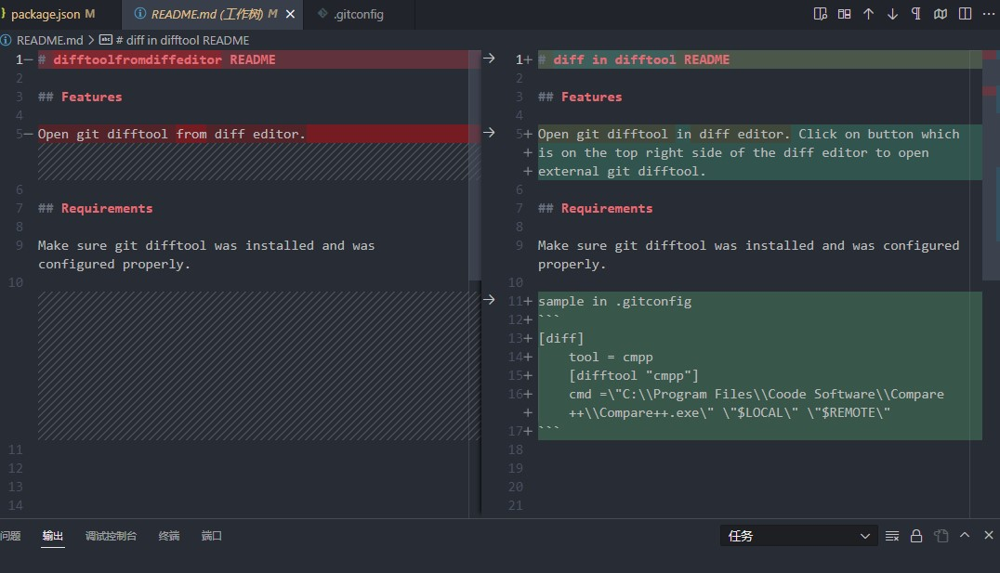

# diff in difftool README

## Features

Open git difftool in diff editor. Click on button which is on the top right side of the diff editor to open external git difftool.



## Requirements

Make sure git difftool was installed and was configured properly.

sample in .gitconfig
```
[diff]      
	tool = cmpp
	[difftool "cmpp"]  
	cmd =\"C:\\Program Files\\Coode Software\\Compare++\\Compare++.exe\" \"$LOCAL\" \"$REMOTE\"
```


